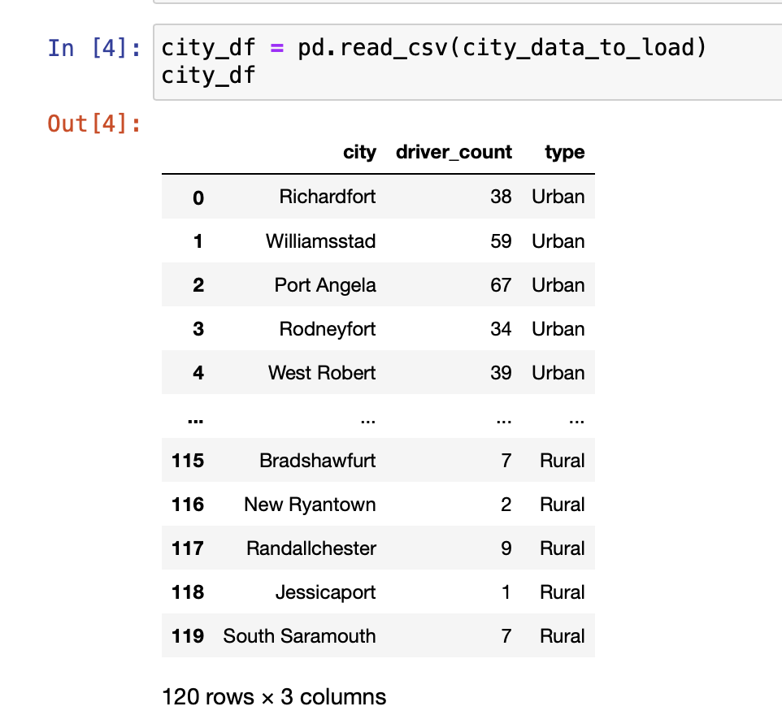
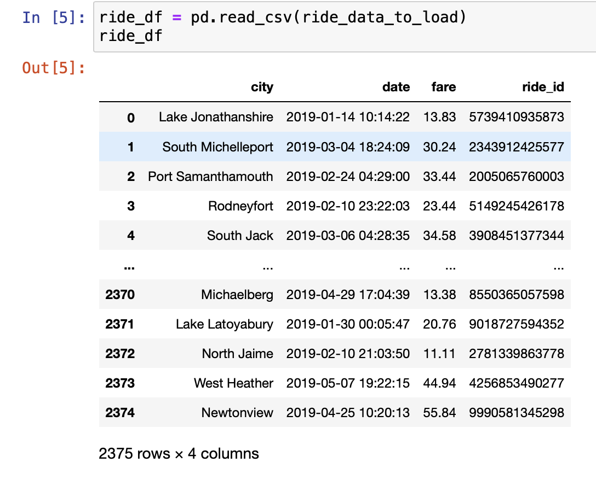
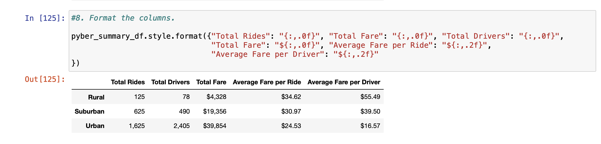
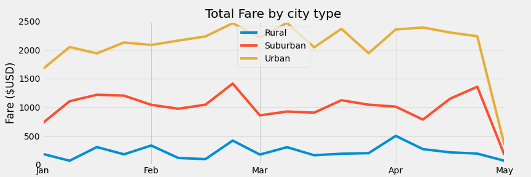

# Overview of the analysis

In this project we are analysing a ride-sharing app company valued at $2.3 billion. We created visualizations of rideshare data for PyBer to help improve access to ride-sharing services and determine affordability for underserved neighborhoods. We have two data set city_data and ride_data 

## Results and Analysis

We are analysing the ride sharing data with the three types of cities i.e Urban, Rural and Suburban. We are comparing the data for these three city types and exploring in which area improvement is required and how can we serve underserved neighborhoods.

1. As we can see that Urban city types has highest number of total rides  1,625, followed with Surburban and least is of Rural. Also total number of drivers in the Urban cities are very high i.e 2,405 , but number of rides is 1,625. This explains that 780 drivers are not getting rides.This is drawback that can be improvised by increasing campaigning and marketing in Urban areas.
2. We can also infer that Average fare per Ride in Urban cities are less i.e $24.83 compared to Rural Cities which is $34.82. Although number of rides and number of drives in rural areas are very less the average fare per ride is highest among the three. Also average fare per driver is very high $55.49. So this concludes that rural drivers are earning more compared with Urban city drivers due to demand supply issues. 
3. Total Fare in Urban cities is highest $39,854 and least fare is $4,328. There is good earning for drivers in rural city type and very low earning for drivers in Urban City types.

This is a multiple-line chart of total fares for each city type where each week is a peak or dip in the graph. The three lines depicts City type as it can observed that Urban City type has highest fares all over the week and it is also infered that from Mid of Feb fares has exponential growth and its peak was at around $2500 but after that this was huge decline in the fare. March month has very unpredictable fare changes in every week. One week was growth and other has decline. But in Suburban and rural City type march month was almost stangant. Suburban City type has highest peak in Mid of Feb at $1500.In summary, the drop in the number of ride usage in the rural cities within the months of January to April, 2019 could be due to the low number of available rides and drivers in those cities and allocating more rides & drivers to the rural cities will most likely reduce average fare per ride & driver which will invariably boost ride affordability.
### Recommendations
With the  more demographic information such as population and age range, we can group the fares by age and city type or by population and city type. These information will shed more light on the reason why some of the city types had high average fare per driver and ride.

## Summary

1. Ride sharing App should expand buisness in Rural and Suburban City types , which also includes hiring more drivers 

2. For specific Urban City type more marketing and emphases on increasing rides should be the main focus. As the fare is highest and consistent new buisness oppurtunies will expand buisness.

3. In rural City types fare should be increased per ride which will overall increase business financial income.

